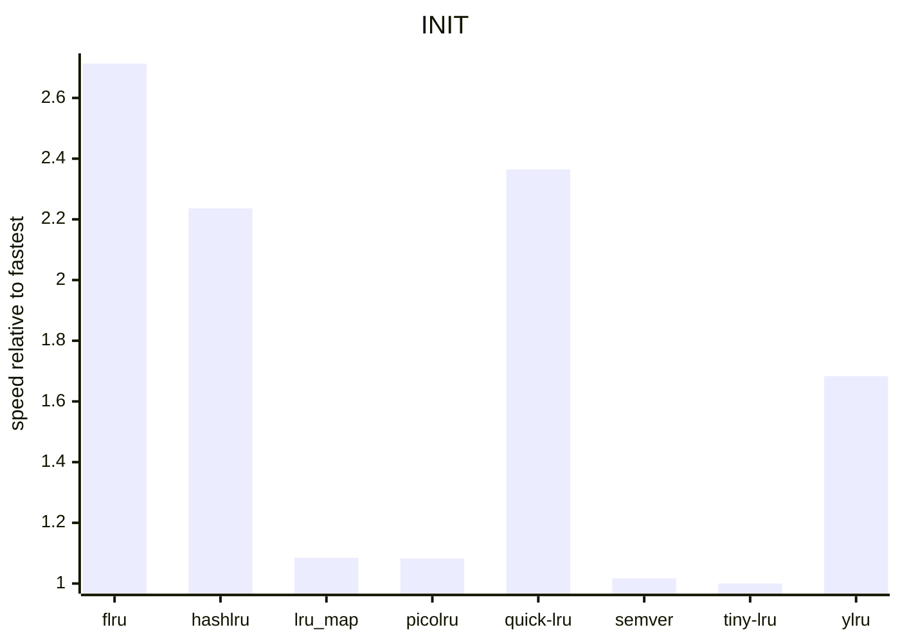
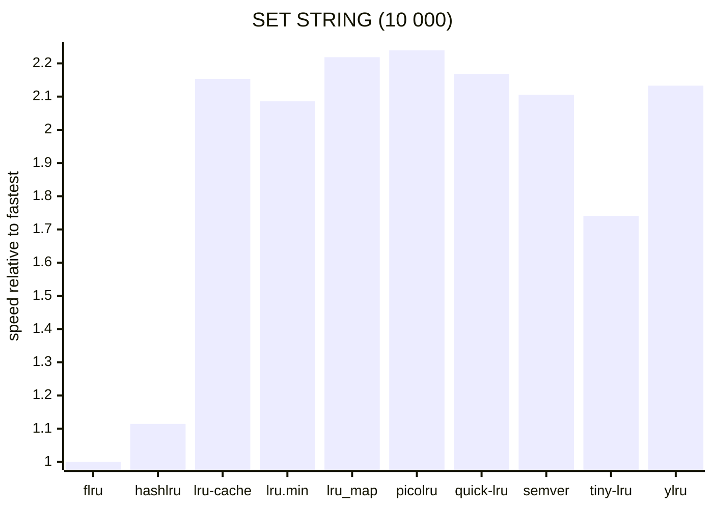
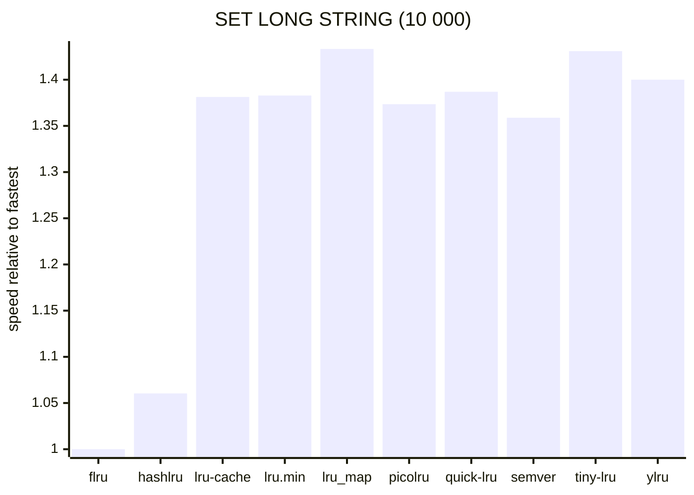
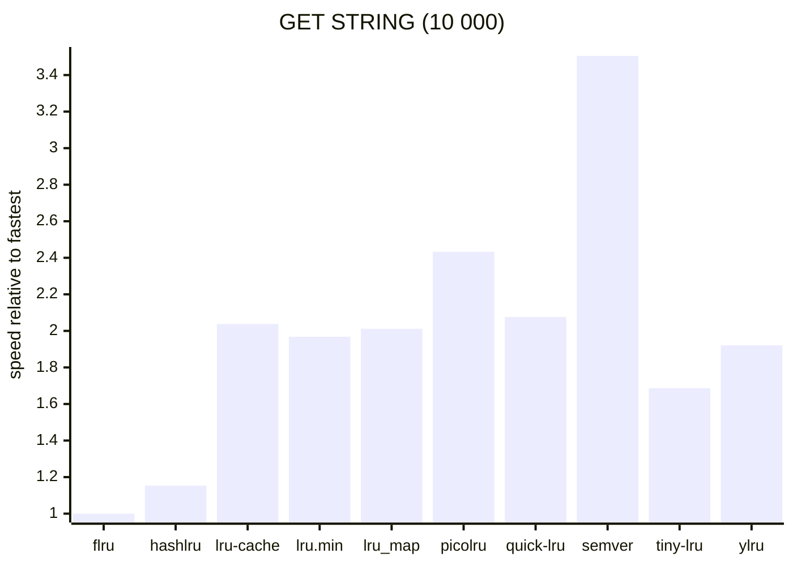
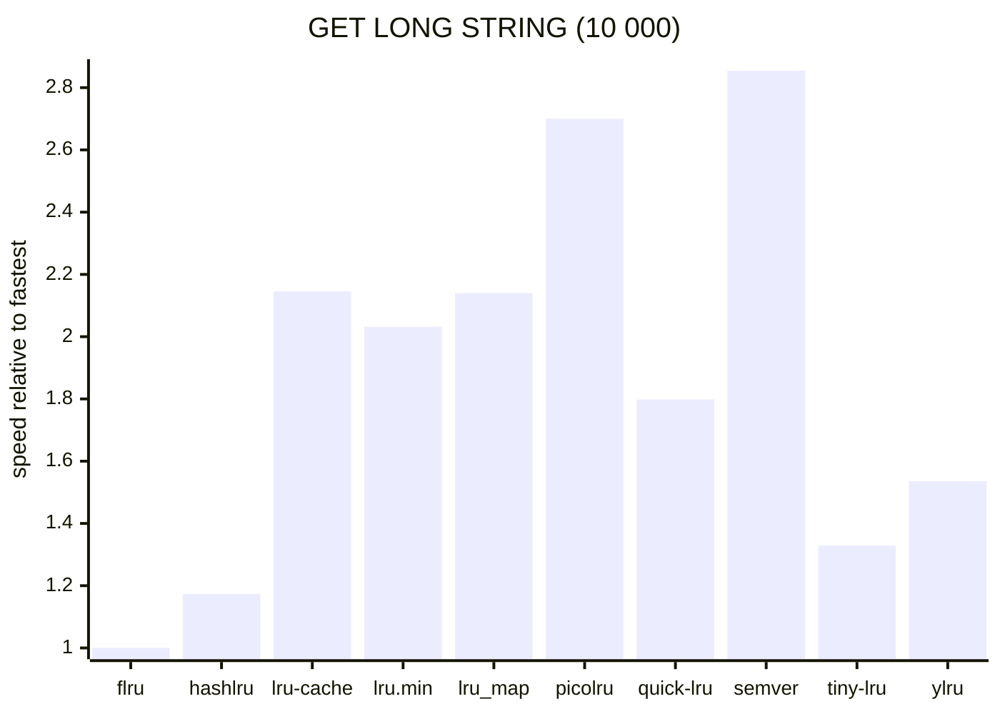
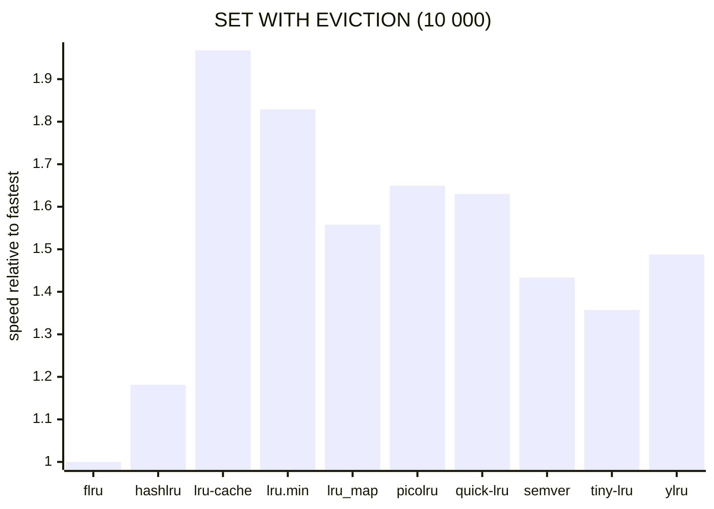

# bench-lru

A set of simple benchmarks for various LRU packages.

---

<!-- BENCHMARKS START -->

node 24.12.0 (x64-win32)

4.91GHz AMD Ryzen 7 9800X3D 8-Core Processor

---

Hidden outliers:

- `lru-cache: 2,758,965.52x`
- `lru.min: 4,113,656.32x`

---

---

---

---

---

<!-- BENCHMARKS END -->
