# bench-lru

A set of simple benchmarks for various LRU packages.

---

<!-- BENCHMARKS START -->

node 24.12.0 (x64-win32)

4.91GHz AMD Ryzen 7 9800X3D 8-Core Processor

---

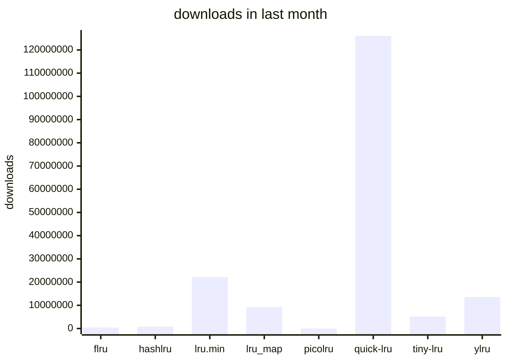

Hidden outliers:

- `lru-cache`: `1,154,015,643`

Complete graph with outliers

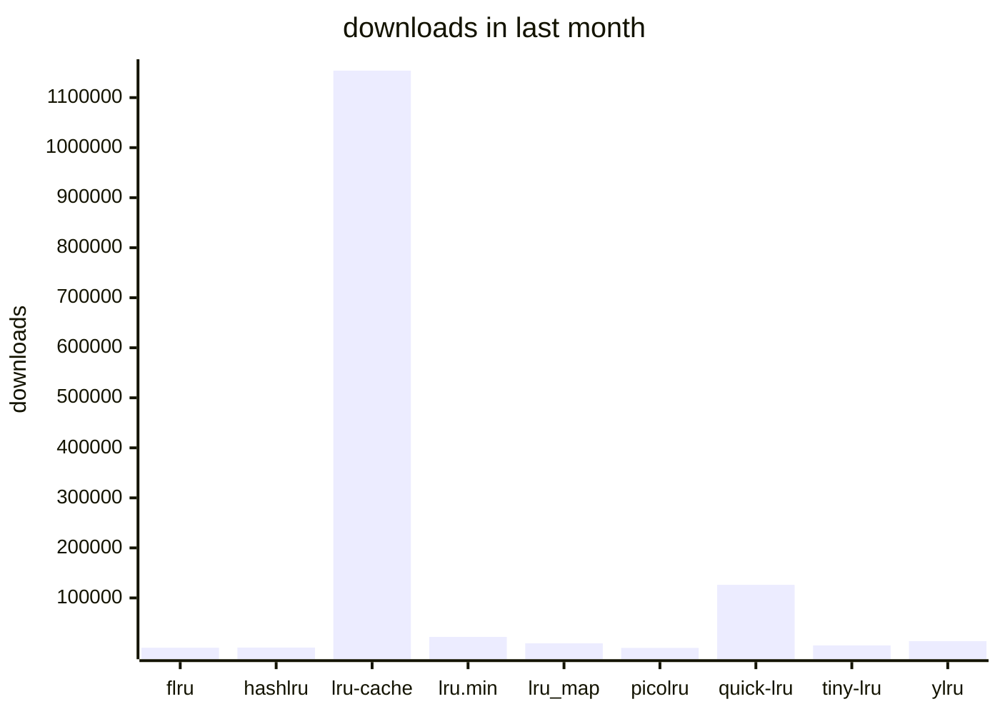

---

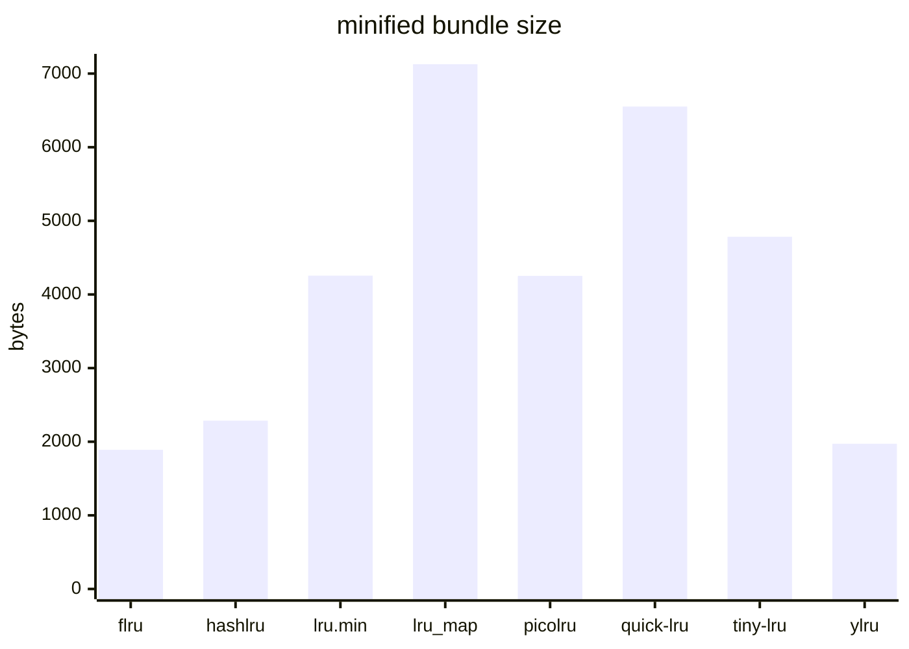

Hidden outliers:

- `lru-cache`: `34,276`

Complete graph with outliers

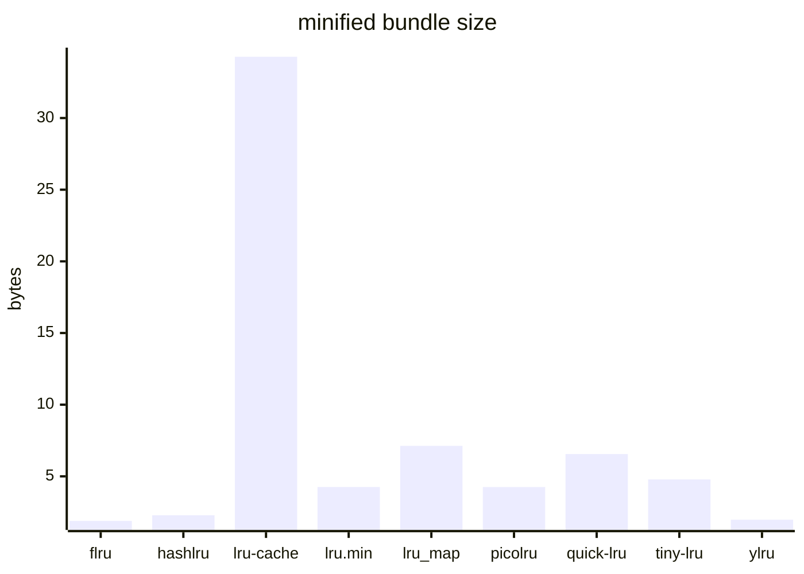

---

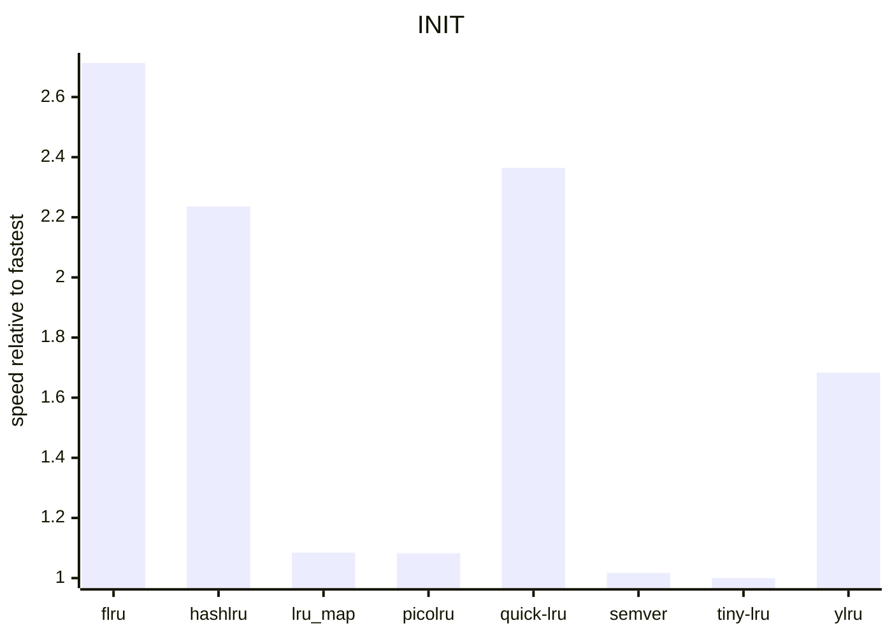

Hidden outliers:

- `lru-cache`: `2,758.97`
- `lru.min`: `4,113.66`

Complete graph with outliers

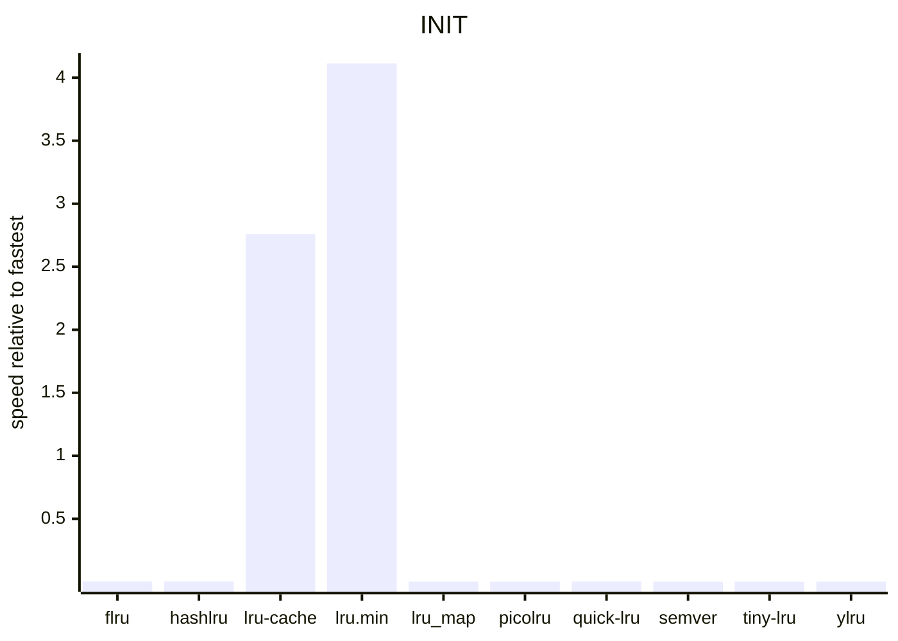

---

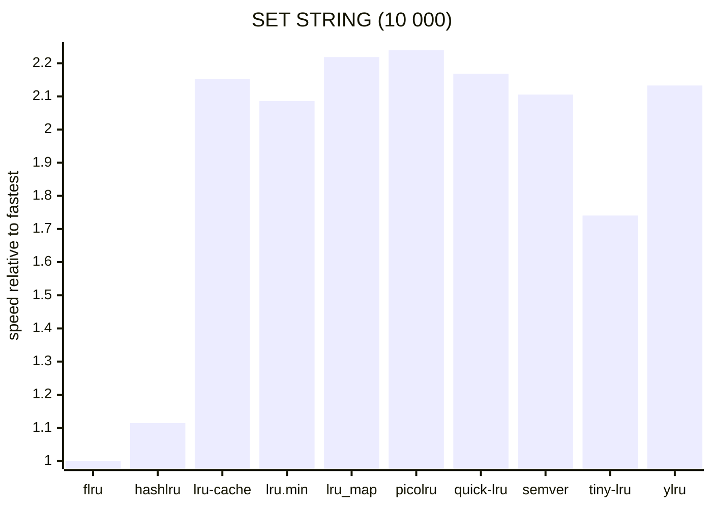

---

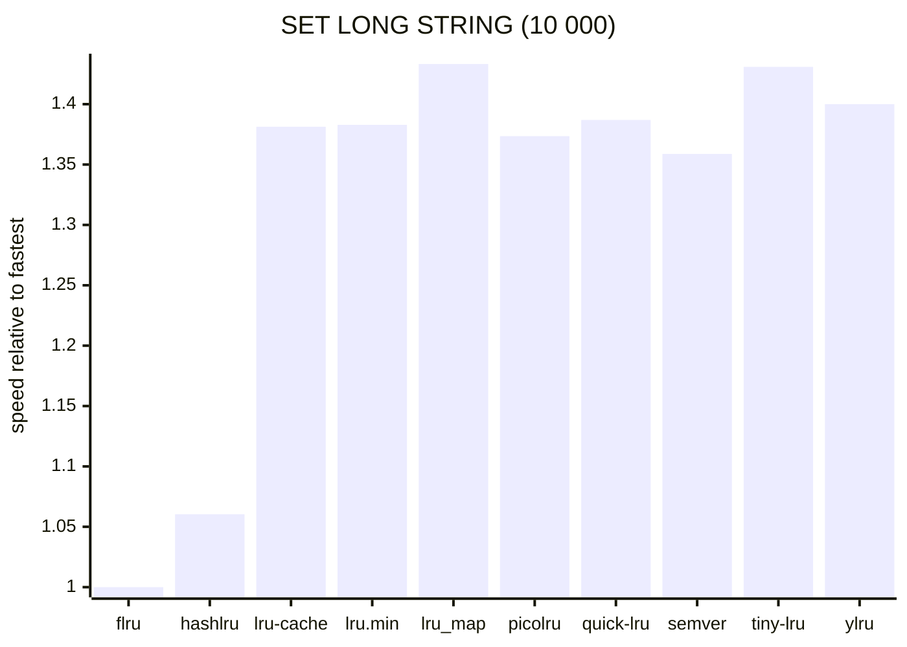

---

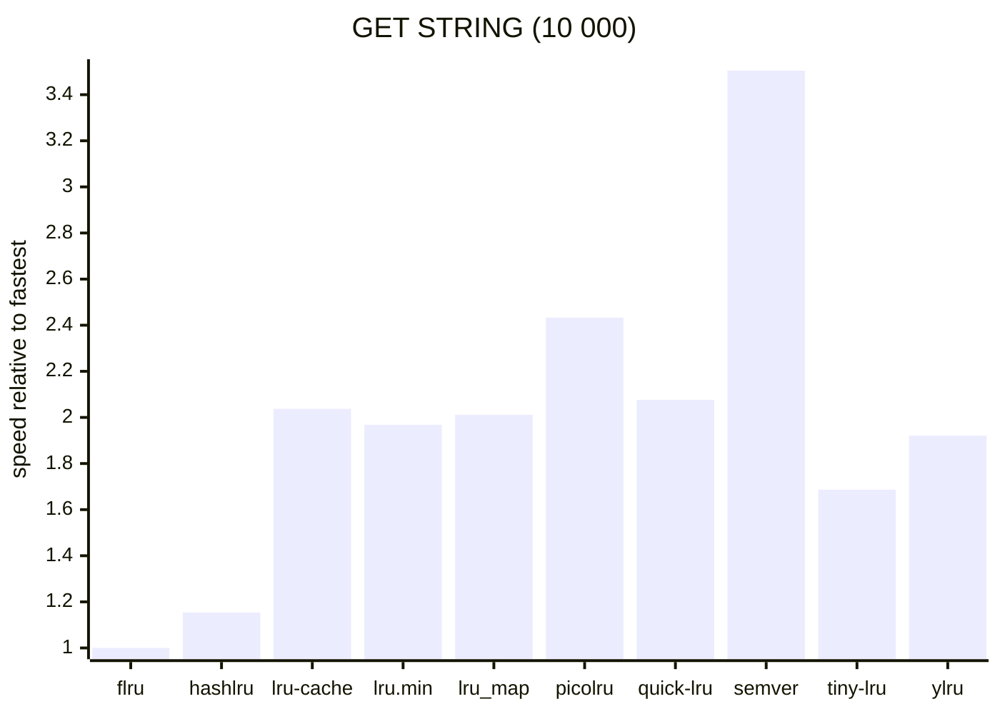

---

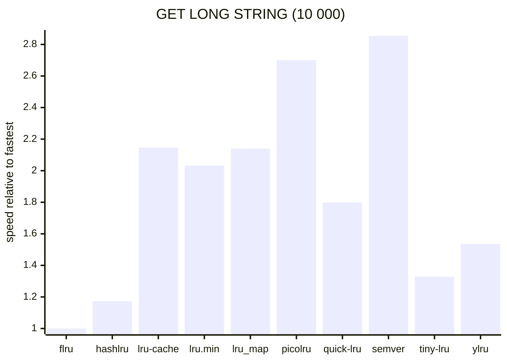

---

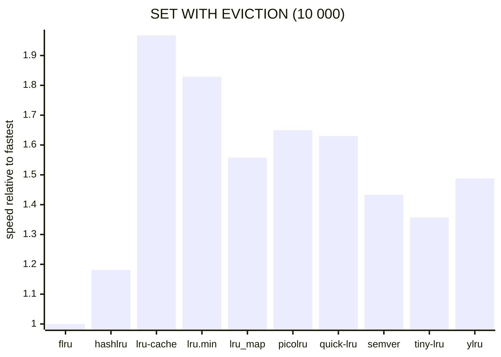

<!-- BENCHMARKS END -->
